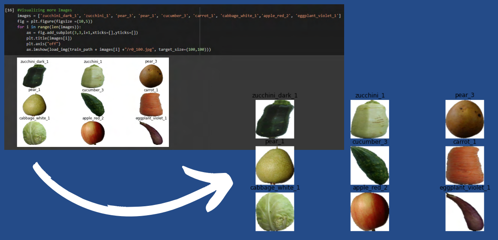

# <h1 align="center">Fruit Image Classification

# <h1 align="center">:apple: :lemon: :cherries: :pear: :pineapple: :watermelon: :strawberry: :banana:
  
# Fruit Image Classification using CNN

### 

# Motivation of the work:
### CNN is a powerful algorithm for image processing. These algorithms are currently the best algorithms we have for the automated processing of images. Many companies use these algorithms to do things like identifying the objects in an image. Images contain data of RGB combination.

# Objective of the work:
### We will define a network architecture and set up a training loop and we will train the CNN model and evaluate its performance using a validation/test set. We will experiment with different network architectures, hyperparameters & regularization techniques.

